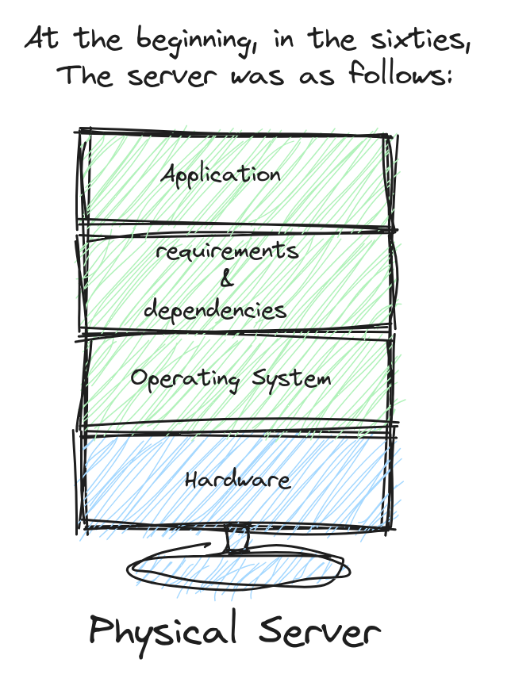

# DockerInDeep

### Table of content

1. [Why did the concept of virtualization appear in 1960?.](#desc0)
2. [Virtualization.](#desc1)


<a name="desc0"></a>
### Why did the concept of virtualization appear in 1960?




<a name="desc1"></a>
### Virtualization

**```There is a lot of talk about virtualization, but here we will talk about hardware virtualization.```**

- Hardware Virtualization: This involves creating virtual machines (VMs) that emulate a complete hardware environment, including:
  - CPU.
  - memory.
  - storage.
  - network components.
- We can do this by adding another layer, which is called a ```hypervisor```.
  - Hypervisor: ```software``` or ```firmware``` that creates and manages VMs. It allows multiple operating systems to share a single hardware host.
  - Types of Hypervisors:
    - Type 1 (Bare Metal): runs directly on the host's hardware to control the hardware and to manage guest operating systems.
      - VMware ESXi.
      - Microsoft Hyper-V.
      - KVM (Kernel-based Virtual Machine).
      - Xen. 
    - Type 2 (Hosted): runs on a standard operating system, just like other computer programs. This type is usually used for testing and development.
      - Oracle VirtualBox.
      - VMware Workstation. 

- Check out the figure for more explanation.


- Safaret News Magazine will answer how hardware virtualization solved the issues that we faced before, and the challenges it seeks to solve.

  
