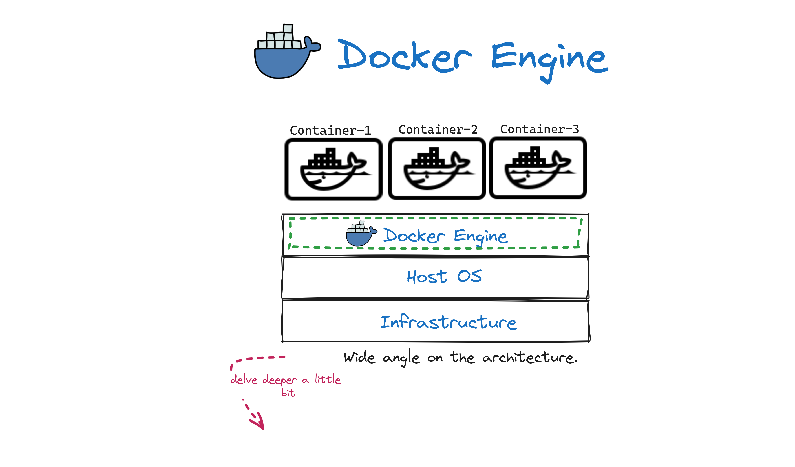

# DockerInDeep

```Note that this repo is under improvement, so take a pomegranate and have a nice day.```

### Table of content

1. [Why did the concept of virtualization appear in 1960?.](#desc0)
2. [Virtualization.](#desc1)
3. [Brief about ```Base Image``` and the ```Differencing Disk``` in virtual machines.](#desc2)
4. [Containers.](#desc3)
5. [How do containers depend on the kernel? Or what technology in the kernel enables this?](#desc4)
6. [The technology that is provided to deal with this container concept.](#desc5)
7. [Crucial concept between a virtual machine and a container.](#desc6)
8. [Docker Installation.](#desc7)
9. [Docker Engine.](#desc8)
10. [Docker client and Docker daemon communication.](#desc9)

<a name="desc0"></a>
### Why did the concept of virtualization appear in 1960?


<a name="desc1"></a>
### Virtualization

**```There is a lot of talk about virtualization, but here we will talk about hardware virtualization.```**

- Hardware Virtualization: This involves creating virtual machines (VMs) that emulate a complete hardware environment, including:
  - CPU.
  - memory.
  - storage.
  - network components.
- We can do this by adding another layer, which is called a ```hypervisor```.
  - Hypervisor: ```software``` or ```firmware``` that creates and manages VMs. It allows multiple operating systems to share a single hardware host.
  - Types of Hypervisors:
    - Type 1 (Bare Metal): runs directly on the host's hardware to control the hardware and to manage guest operating systems.
      - VMware ESXi.
      - Microsoft Hyper-V.
      - KVM (Kernel-based Virtual Machine).
      - Xen. 
    - Type 2 (Hosted): runs on a standard operating system, just like other computer programs. This type is usually used for testing and development.
      - Oracle VirtualBox.
      - VMware Workstation. 

- Check out the figure for more explanation.


- Safaret News Magazine will answer how hardware virtualization solved the issues that we faced before, and the challenges it seeks to solve.

  


<a name="desc2"></a>
### brief about ```Base Image``` and the ```Differencing Disk``` in virtual machines
**```Before we talk about containers, let's review an important concept from the virtual machine, which is the Base Image and the Differencing Disk.```**

- **Base Disk**: is a read-only disk image that contains the core operating system, applications, and system configurations. It serves as the template for creating multiple VMs.
- **Differencing Disk**:
   - Differencing disks are associated with specific virtual machines (VMs) and track the changes made to the base image during the VM's operation.
   - Each VM has its own differencing disk, allowing customization and modifications without altering the original base image.
   - Multiple VMs can use the same base image, and each VM has its own differencing disk to capture its unique modifications.
- **Size Calculation**: ```by assuming that```
  - Base Image Size: 20GB
    - VM1 Differencing Disk: 5GB (assuming 5GB of changes specific to VM1)
      - Total disk usage for VM1: 20GB (base image) + 5GB (differencing disk) = 25GB
    - VM2 Differencing Disk: 10GB (assuming 10GB of changes specific to VM2)
      - Total disk usage for VM2: 20GB (base image) + 10GB (differencing disk) = 30GB
    - VM3 Differencing Disk: 7GB (assuming 7GB of changes specific to VM3)
      - Total disk usage for VM3: 20GB (base image) + 7GB (differencing disk) = 27GB

<a name="desc3"></a>
### Containers

- Since any operating system has a kernel, if there's a way to use the kernel of the main machine, whether it's a physical machine or a virtual machine, and remove all the operating systems from each VM, and if we need any OS specification, we can add it as a layer on top of the host operating system kernal which will be good. that actually the container makes this.


- The same concept of the ```Base Image``` and the ```Differencing Disk``` in virtual machines is here in the containers.


<a name="desc4"></a>
### How do containers depend on the kernel? Or what technology in the kernel enables this?

- First of all, let's learn about two important Linux kernel features: ```namespaces``` and ```cgroups```.
   - ```Namespaces``` and ```cgroups``` are two important Linux kernel features that provide mechanisms for isolating and controlling processes and resources.
   - ```namespaces``` are used to provide process isolation and create lightweight containers, while ```cgroups``` are used to control resource allocation and limits for those containers. This combination allows you to run multiple isolated environments on a single host machine, each with its own set of processes and resource constraints.
     
     
- In the figure below, let say that the container starts with proc_1, which is ```RUN CONTAINER```, then opens proc_2, which is ```OS specification```, and each process will open the next one. Linux Kernal considers all of these processes as a single process. and using the ```namespaces``` technique to isolate all these processes from all operating system.


<a name="desc5"></a>
### The technology that is provided to deal with this container concept.

- ```Docker``` is perhaps the most well-known container platform. So this repo will take a closer look into Docker.

<p align="center">

</p>


<a name="desc6"></a>
### Crucial concept between a virtual machine and a container.


<a name="desc7"></a>
### Docker Installation.
- You can use the repo [docker-install](https://github.com/docker/docker-install), which is virified by Docker, or see the [Docker Docs](https://docs.docker.com/).
- After that, check if the installation is done by running ```docker info```.
- If you faced issue is related to privilege or permissions, it's essential to ensure that your user has the necessary privileges to interact with Docker.
   - So you have to add the user to the Docker Group:->
        ```sudo usermod -aG docker $USER```
   - After running this command, restart your system for the changes to take effect.

### Docker Engine. 
<a name="desc8"></a>




- runc
   - For each running container, containerd creates a process called runc.
   - runc is responsible for anything related to this container such as starting, stopping, pausing, and more.
- shim ```containerd + runc```
   - The shim acts as a bridge between the container runtime "containerd" and the actual container process "managed by runc".
   - It stays around even after the main container tool (like runc) has finished its job.How??
       - runc s responsible for starting the container process and managing the low-level details of container execution.
       - Once the container process is up and running, runc's primary role is considered done.
       - the shim doesn't terminate immediately after runc has finished its primary tasks. Instead, it remains active in the background
   - Ensures that communication channels, such as STDIN and STDOUT streams, remain open between the container and the outside world.
   - Reports back to the container manager (e.g., containerd) to keep it informed about the status and health of the container. 
- So, this model achieves a ```loosely coupled architecture```.
   - Separating the container runtime from the Docker daemon, allowing each component to perform its specialized functions.```daemonless containers```
   - Since the container runtime is not coupled with the Docker daemon, you can perform maintenance tasks such as ```upgrades``` or ```restarts``` on the Docker daemon without affecting the running containers managed by the container runtime.

<a name="desc9"></a>
### Docker client and Docker daemon communication.


